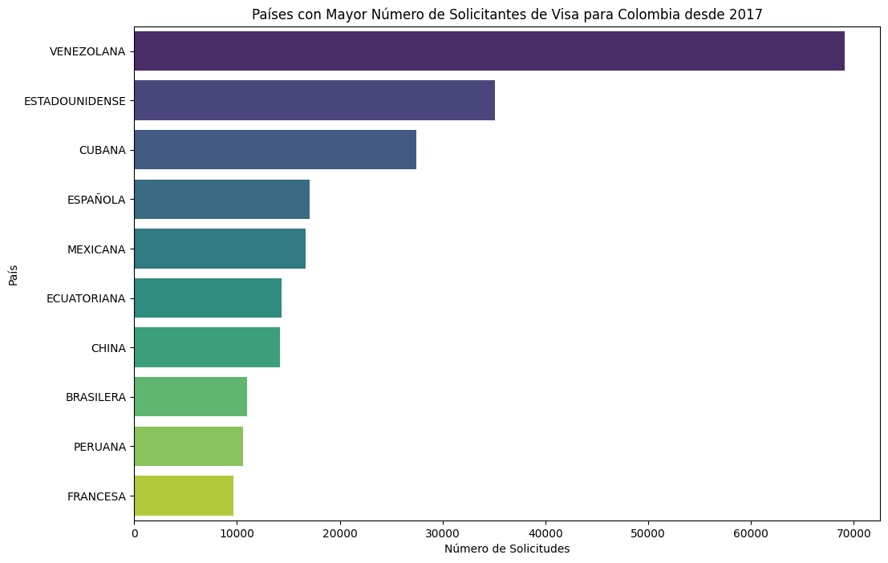
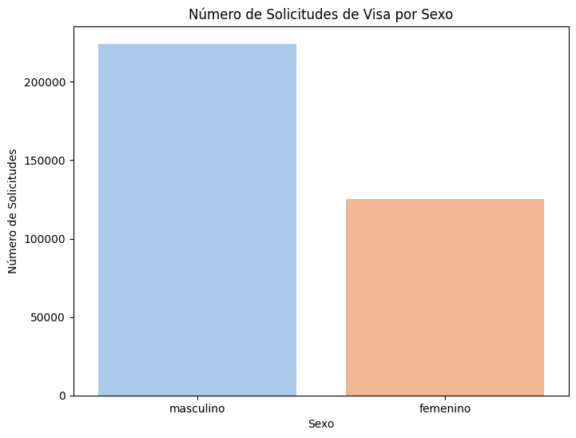

# Perfil #1 - Departamento de Migración (Política migratoria y control fronterizo)

Este perfil corresponde a académicos, analistas o funcionarios que estudian tendencias migratorias.

## Pregunta #1

**Pregunta:** ¿Cuáles son los países con más solicitantes de visa para Colombia?

**Respuesta:** Desde 2017, los países con más solicitantes de visa para Colombia son: Venezuela, Estados Unidos, Cuba, España, México, Ecuador, China, Brasil, Perú y Francia, en ese orden.

**Gráfica:**

#

## Pregunta #2

**Pregunta:** ¿Existe una diferencia significativa en la cantidad de solicitudes según el sexo del solicitante?

**Respuesta:** Sí, hay una diferencia significativa en la cantidad de solicitudes según el sexo del solicitante, ya que hay más solicitudes masculinas que femeninas, como se evidencia en la gráfica.

**Gráfica:**

#