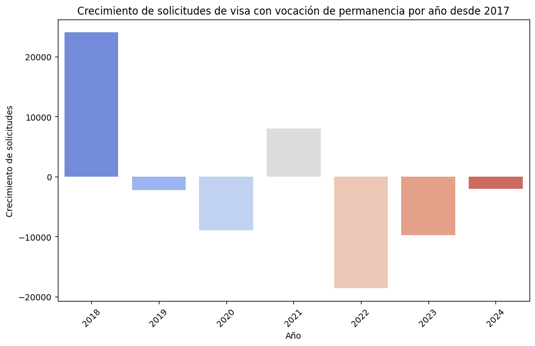
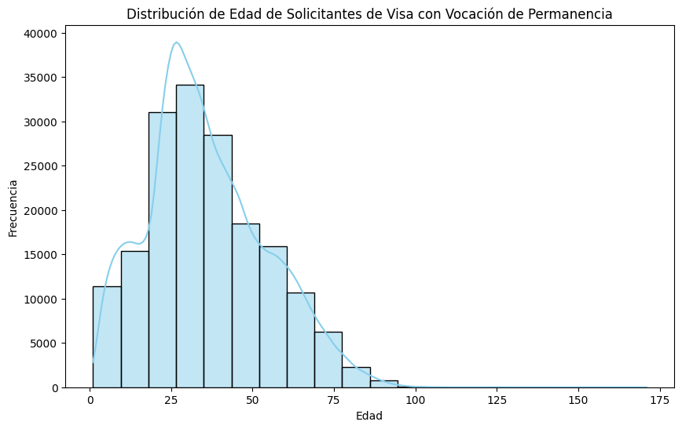

# Perfil #2 - Reclutador de Talento Internacional

Empresas que buscan contratar talento extranjero o gestionar movilidad laboral.

## Pregunta #1

**Pregunta:** ¿Cuáles son los años con mayor crecimiento en solicitudes de visa con vocación de permanencia?

**Respuesta:** El año con el mayor crecimiento en solicitudes de visa con vocación de permanencia fue 2018, con un incremento significativo. También se observa un crecimiento en 2021, aunque en menor medida. En contraste, 2022 y 2023 presentaron las mayores disminuciones en solicitudes.

**Grafica:**

#

## Pregunta #2

**Pregunta:** ¿Qué edad promedio tienen los solicitantes de visa con vocación de permanencia?

**Respuesta:** La mayoría de los solicitantes tienen entre 20 y 40 años, con un pico en torno a los 25 años, lo que sugiere que la edad promedio está en ese rango.

**Grafica:**

#