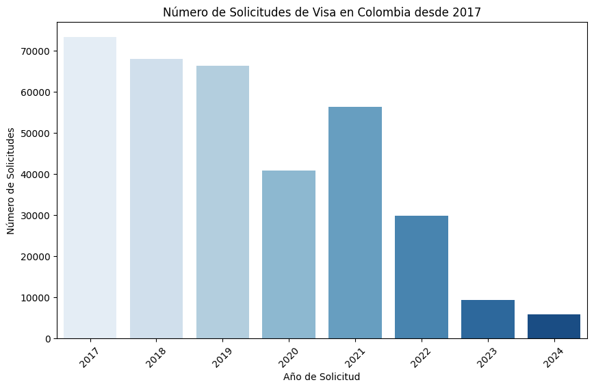
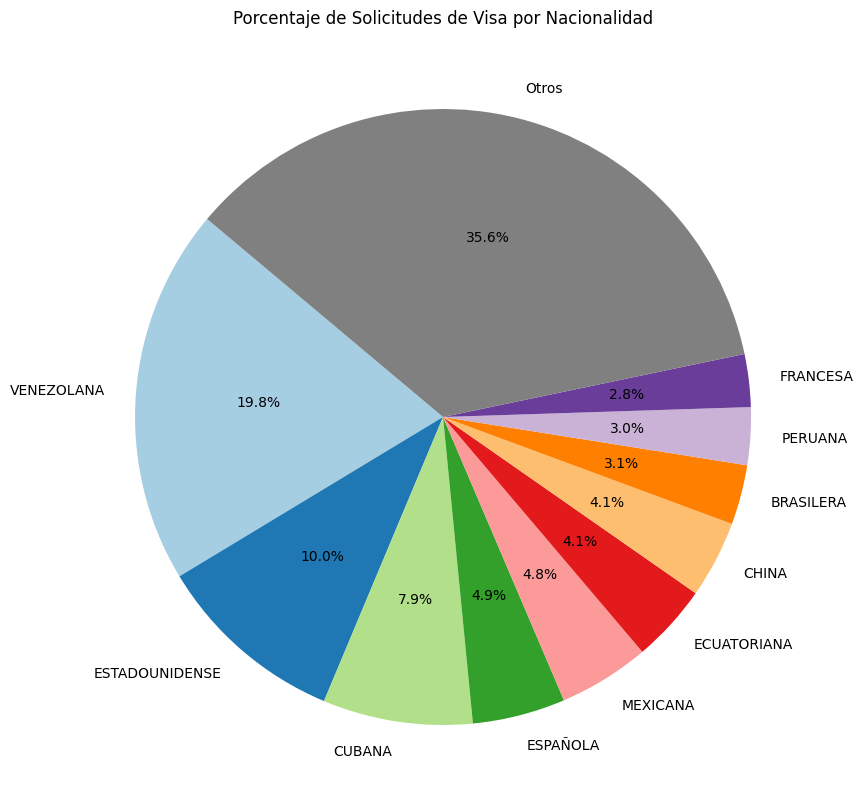

# Perfil #3 - Periodista en Medios de Comunicación

Interesado en informar sobre tendencias migratorias en Colombia.

## Pregunta #1

**Pregunta:** ¿Cuántas solicitudes de visa se han registrado anualmente en Colombia desde el 2017?

**Respuesta:** El número de solicitudes de visa en Colombia ha variado significativamente desde 2017. En ese año, se registraron aproximadamente 73,000 solicitudes, mientras que en 2018 y 2019 las cifras fueron de 69,000 y 67,000, respectivamente. Sin embargo, en 2020, debido posiblemente a la pandemia, el número disminuyó a 42,000, aunque en 2021 hubo un repunte hasta 57,000. En los años siguientes, la tendencia fue a la baja, con 31,000 solicitudes en 2022, 9,000 en 2023 y apenas 6,000 en 2024.

**Grafica:**

#

## Pregunta #2

**Pregunta:** ¿Qué porcentaje del total de solicitudes corresponde a cada nacionalidad?

**Respuesta:** El porcentaje de solicitudes de visa en Colombia está distribuido entre diversas nacionalidades. Los venezolanos representan la mayor proporción con un 19.8%, seguidos por los estadounidenses con un 10.0%, los cubanos con un 7.9% y los españoles con un 4.9%. Otras nacionalidades con una participación relevante incluyen los mexicanos con un 4.8%, ecuatorianos y chinos con 4.1% cada uno, brasileños con 3.1%, peruanos con 3.0% y franceses con 2.8%. Finalmente, un 35.6% de las solicitudes provienen de otras nacionalidades no especificadas en el desglose principal.

**Grafica:**

#